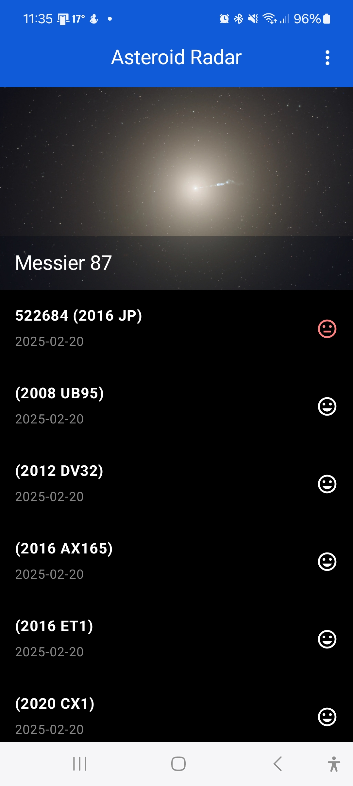
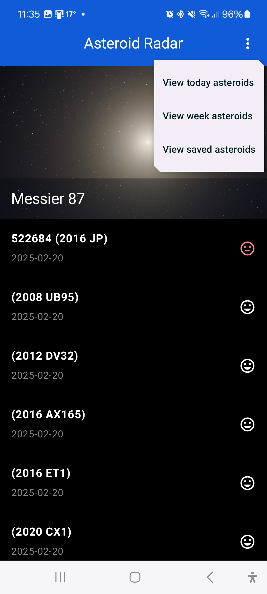
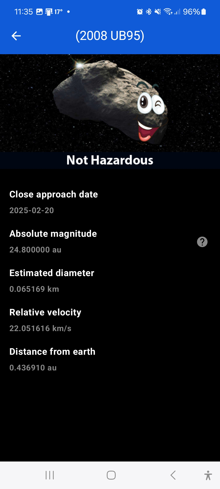
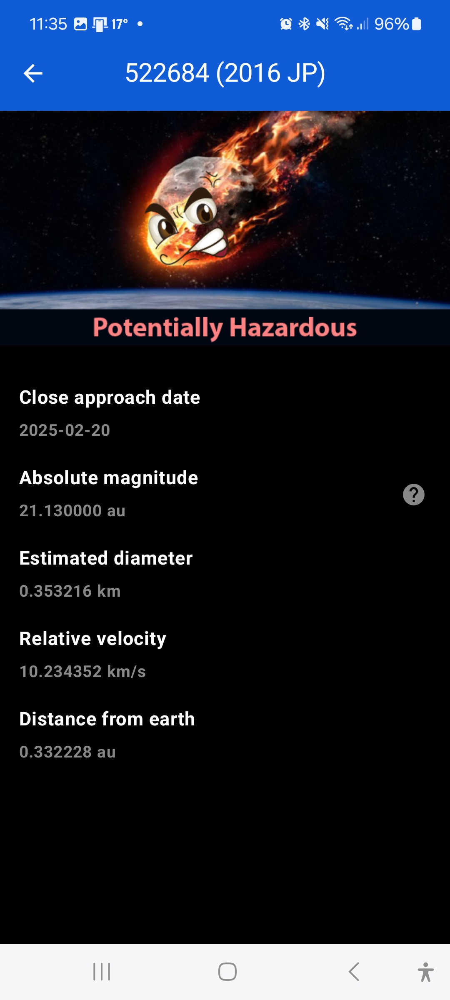
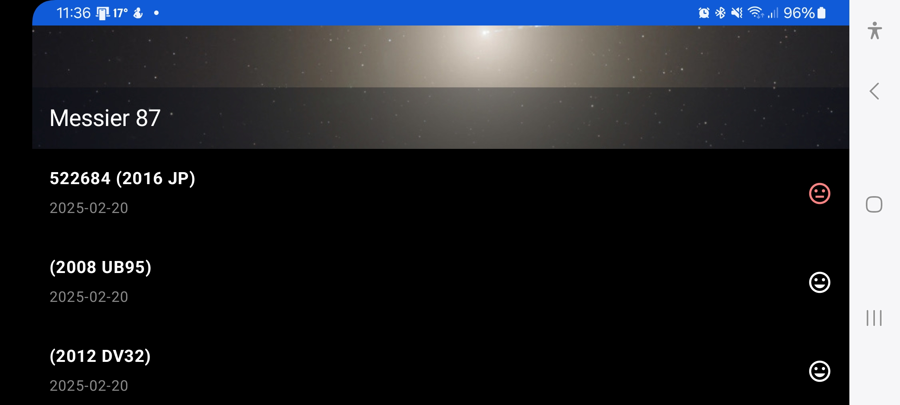

# AsteroidApp [![Build Status][ci-image]][ci]

**"A NASA-powered Compose app to monitor asteroids and their Earth proximity, with offline features and clean architecture."**
 Asteroid App is a Compose app designed to help users track asteroids detected by NASA that come near Earth. It uses a free, open-source API provided by the NASA JPL Asteroid team and stores data locally for offline access. This project is part of the **Udacity Android Kotlin Developer Nanodegree Program**.

## Main Features of the Project

- **Modern UI**: Use Jetpack Compose for modern UI. Also uses a single-activity architecture with multiple fragments for simplified navigation and improved modularity (in the XML branch).
- **MVVM and Repository Architecture**: Implements MVVM and Repository to enhance maintainability, modularity, and scalability, promoting cleaner code and separation of concerns.
- **Offline Mode**: Provides offline access to data by using Room for local storage, ensuring the app is usable even without an internet connection.
- **Paging Library (v3)**: Optimizes data viewing with seamless scrolling, ensuring smooth navigation through large lists of asteroids.
- **Accessible UI**: Dynamically generated ContentDescriptions to enhance accessibility, making the app inclusive for all users.
- **Orientation Support**: Adapts to portrait and landscape orientations without losing data or state, ensuring a smooth user experience.
- **Dependency Injection**: Koin (v4) improves modularity and testability by effectively managing dependencies.
- **Reactive UI**: Incorporates DataBindingAdapter and Kotlin Flow for a reactive and responsive user experience (in the XML branch).

## Showcased Skills

- **Clean Architecture**: Enforced separation of concerns through domain, data, and presentation layers.
- **Offline-first Design**: Implemented offline access using Room, ensuring a consistent user experience even without network availability, supported by periodic background data updates using WorkManager to keep the data fresh.
- **Scalable Codebase**: Followed MVVM and Repository patterns to make the project scalable and maintainable.
- **Reactive Programming**: Utilized Kotlin Flow to efficiently handle data streams, making the app responsive and resource-efficient.
- **Accessibility**: Implemented accessibility features, including dynamic content descriptions and support for screen readers, to promote an inclusive experience for all users.

## Project Resources

- [Starter Project Code](https://github.com/udacity/nd940-android-kotlin-c2-starter/tree/master): Get the starter code for the project.
- [Project Rubric](https://docs.google.com/document/d/1zuizdkZE564NyypAysOyI8sX7mICE64eMlmOPUV8W9w/edit?usp=sharing): View the project rubric.
- [Android Kotlin Developer Nanodegree Program](https://www.udacity.com/course/android-kotlin-developer-nanodegree--nd940): Learn more about the full program and its related projects.

#### **Note**: Many improvements and features in this project are not included in the Project Rubric as it was initially a project for the Udacity Nanodegree Program.

## Installation Guide

This project requires a NASA API Key. Follow these steps to run the app:

1. **Clone the Repository**: Clone the project repository using Git.
2. **Open in Android Studio**: Open the project in **Android Studio Ladybug (2024.2.1 Patch 2)** or later.
3. **Generate NASA API Key**: Obtain your [NASA API Key](https://api.nasa.gov/).
4. **Add NASA API Key**: Add the NASA API key to the `local.properties` file:
```NASA_API_KEY="YOUR_API_KEY_HERE"```
Alternatively, follow the [Secrets Gradle Plugin guide](https://developers.google.com/maps/documentation/places/android-sdk/secrets-gradle-plugin).
5. **Build the Project**: Use **Gradle Plugin v8.7.2** to build the project.

**Note:** Ensure you have the latest version of Android Studio and the Gradle build tool installed. Please look at the [official guide](https://developer.android.com/studio/install) if needed.

## Main Included External Libraries

- **[Koin (v4)](https://github.com/InsertKoinIO/koin)**: Dependency injection framework, allowing modularity and making the project easier to test.
- **[Timber](https://github.com/JakeWharton/timber)**: Logging utility to simplify debugging.
- **[Coil](https://github.com/coil-kt/coil)**: Image loading and caching for efficient display of images.
- **[Retrofit](https://github.com/square/retrofit)**: REST API management for fetching data from NASA's servers.
- **[Moshi](https://github.com/square/moshi)**: JSON parsing for managing API responses.
- **[Secrets Gradle Plugin](https://developers.google.com/maps/documentation/places/android-sdk/secrets-gradle-plugin)**: Secure management of sensitive data like API keys.
- **[KSP](https://developer.android.com/build/migrate-to-ksp)**: Annotation processing plugin for improved build performance.

## Snapshots from the App  

### Phone Screens (Portrait)  

<div align="center">
<table>
<tr>
 <td align="center">
   
   <p><strong>Asteroid List Screen</strong><br>Displays a paging list of asteroids with essential information.</p>
 </td>
 <td align="center">
   
   <p><strong>Asteroids Filter Scren</strong><br>Customizable filter to auto-fetch specific data using Repository.</p>
 </td>
</tr>
<tr>
 <td align="center">
   
   <p><strong>Asteroid Detail - Non-Hazardous Screen</strong><br>Dynamic previews details of a non-hazardous asteroid.</p>
 </td>
 <td align="center">
   
   <p><strong>Asteroid Detail - Hazardous Screen</strong><br>Dynamic previews details of a hazardous asteroid.</p>
 </td>
</tr>
</table>
</div>  

### Phone Screens (Landscape)  

<div align="center">

<p><strong>Asteroid List Screen in Landscape Mode</strong><br>Optimized for a seamless landscape viewing experience.</p>
</div>  


## Contributing

Contributions are welcome! Please open an issue or submit a pull request for improvements or bug fixes. Please feel free to reach out if you'd like to add new features or expand on existing ones.

### How to Contribute

- **Fork the Repository**: Click the "Fork" button at the top.
- **Create a Feature Branch**: Branch off from `main` for any features (`git checkout -b feature/your-feature`).
- **Submit a Pull Request**: Submit a PR describing your changes.

## Contact

Feel free to reach out for any collaboration opportunities or if you have any questions. I'd love to hear your thoughts and contributions!
Check my **[GitHub profile](https://github.com/AliElDerawi)**.

## License

This project is open-source and licensed under the Apache 2.0 License. The LICENSE file in this repository provides more details.
